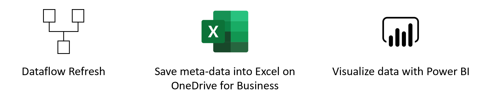
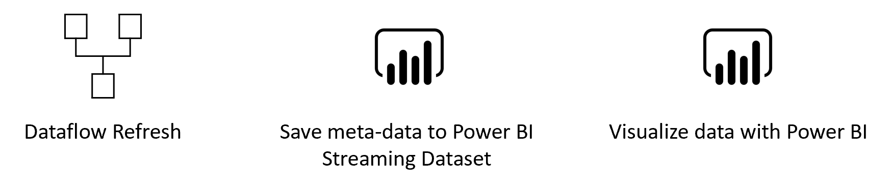

# Dataflow Power Automate Connector 
In this **[POST]** you can read about the new connector to:
* Trigger the refresh of Power BI and Power Platform Dataflows
* Trigger an action based on the completion of a dataflow refresh.

In this blog, we are going to discuss some use cases with corresponding templates, to quickstart the use of this connector. We are going to discuss the following templates:

Notifications:
* Send an email notification when a dataflow refresh status changes
* Send email notification on success or failure of a dataflow
* When a dataflow refresh status changes, sends a Teams notification

Support tickets:
* When a dataflow refresh fails, send a message to service bus queue to open a support ticket

Trigger Dataflows/Datasets sequentially
* When you click on button, a dataflow refresh starts
* When an analytical dataflow succeeds refreshing, trigger a standard dataflow
* When a dataflow refresh succeeds, trigger a power BI dataset
* When a file in SharePoint gets updated, trigger a dataflow

Save dataflow meta-data
* When a dataflow refresh completes, save meta-data to Dataverse Table example
* When a dataflow refresh completes, save meta-data to Exel online example
* When a dataflow refresh completes, save meta-data to Power BI Streaming dataset example

## Downloads:
[Download excel .pbix file](https://github.com/miquelladeboer/dataflowdiagnostics/blob/master/diagnostics-template-excel.pbix),
[Download Dataverse .pbix file](https://github.com/miquelladeboer/dataflowdiagnostics/blob/master/diagnostics-template-cds.pbix),
[Dowload .xlsx file](https://github.com/miquelladeboer/dataflowdiagnostics/blob/master/dataflow_monitoring.xlsx)

# Examples

## Notifications
### Use Case
When your dataflow refresh completes, you want to get an email/teams or any other type of nitofication to alert you when your dataflow refresh completes. You can also set alerts based on the refresh status of the dataflow. You could for example only be notified when a dataflow refresh was completed. This way, you know your data is up to date and you can start getting new insights. Another common scenario is not get notified when a dataflow refresh failed. This way you can idediately start ivestigating the problem and alert people that depend on the data being refreshed.

### Using the templates
For sending notifications, we published three templates:
* Send an email notification when a dataflow refresh status changes
* Send email notification on success or failure of a dataflow
* When a dataflow refresh status changes, sends a Teams notification

Let's take a look at the second template:
* Navigate to flow.microsoft.com
* Search for the template **Send email notification on succes or failure of a data flow refresh**, by following these [instructions](https://docs.microsoft.com/en-us/power-automate/get-started-logic-template)

* Customize the flow
    Actions that require input from you will automatically be expanded.

   The **Dataflow Refresh** trigger is expanded because you need to enter *Dataflow*. You need to enter the following information:
   * **Group Type**: Choose *Environment* when connection to PowerApps and *Workspace* when connecting to Power BI
    * **Group**: Select the Power Apps environment or the Power BI workspace you dataflow is in
    * **Dataflow**: Select your dataflow by name

After the condition, you can specify what happens after succes or failure of the dataflow. In this template in both cases, we send you an email with the status of the dataflow refresh.

Note: you can modify the email content or flow.

## Support Tickets

### Use Cases
When your dataflow refresh completes, or has been taking longer than expected, you might want to open a support ticket/create a message in a que or service bus, so your support team can take a look at the issue.

### Using the Templates

Let's look at the template where we want to add a message to the queue, when a dataflow refresh failed. In this template, we make use of Azure Service Bus. To create an Azure Service bus an d create a Queue folllow these [instructions](https://docs.microsoft.com/en-us/azure/service-bus-messaging/service-bus-quickstart-portal#create-a-namespace-in-the-azure-portal).

* Navigate to flow.microsoft.com
* Search for the template **when a dataflow refresh failes, add a new message to the queue**, by following these [instructions](https://docs.microsoft.com/en-us/power-automate/get-started-logic-template)

* Customize the flow
    Actions that require input from you will automatically be expanded.

   The **Dataflow Refresh** trigger is expanded because you need to enter *Dataflow*. You need to enter the following information:
   * **Group Type**: Choose *Environment* when connection to PowerApps and *Workspace* when connecting to Power BI
    * **Group**: Select the Power Apps environment or the Power BI workspace you dataflow is in
    * **Dataflow**: Select your dataflow by name

After the condition, you can specify what happens after succes or failure of the dataflow. In this template in both cases, we send you an email with the status of the dataflow refresh.

Note: you can modify the message content or flow.

## Trigger Dataflows and Power BI Dataset Sequentially

### Use Cases
There are two very common use cases for how you can use this connector to trigger multiple dataflows and Power BI dataset sequentially.

1. Trigger the refresh of a Standard Dataflow after the succesfull completion of an Analytical Dataflow refresh.

If a dataflow performs all actions, then it is hard to reuse its entities in other dataflows or for other purposes. The best dataflows to reuse are those dataflows doing only a few actions. Creating dataflows that specialize in one specific task is one of the best ways of reusing them. If you have a set of dataflows as staging dataflows, their only action is to extract data "as is" from the source system. These dataflows can be reused in multiple other dataflows. For more information, take a look at the [best practices for reusing datafows](https://docs.microsoft.com/en-us/power-query/dataflows/best-practices-reusing-dataflows)

2. Trigger the refresh of a Power BI dataset when a dataflow refresh completed succesfully.

If you want to make sure that your dashboard is directly up-to-date after a dataflow refreshed your data, you can use the connector to trigger the refresh of a Power BI dataset after you dataflow refreshed succesfully.

### Using the Templates

let’s take a look at the first template:
* Navigate to flow.microsoft.com
* Search for the template **Trigger a dataflow refresh after my dataflow refresgh completed succesfully**, by following these [instructions](https://docs.microsoft.com/en-us/power-automate/get-started-logic-template)

* Customize the flow
    Actions that require input from you will automatically be expanded.

   The **Dataflow Refresh** trigger is expanded because you need to enter *Dataflow*. You need to enter the following information:
   * **Group Type**: Choose *Environment* when connection to PowerApps and *Workspace* when connecting to Power BI
    * **Group**: Select the Power Apps environment or the Power BI workspace you dataflow is in
    * **Dataflow**: Select your dataflow by name

After the condition, you can specify what happens after succes or failure of the dataflow. In this template we trigger a new datafow:

   The **refresg a dataflow** ation is expanded because you need to enter *Dataflow*. You need to enter the following information:
   * **Group Type**: Choose *Environment* when connection to PowerApps and *Workspace* when connecting to Power BI
    * **Group**: Select the Power Apps environment or the Power BI workspace you dataflow is in
    * **Dataflow**: Select your dataflow by name

 # Load Data into Dataverse Table and build Power BI report 
In this step-by-step example we will show you how to set up your own monitoring dashboard for Power BI and/or Power Platform dataflows:

You can use this dashboard to monitor your Dataflows Duration and Failure count. This way you can easily track any issues with your dataflows performance and share with others.

First, we are going to create a new table into Dataverse. This table will collect all the metadata from the dataflow run. For every refresh of a dataflow, we add a record to this table. We can run multiple dataflows all to the same table. When we have build the table, we can connect the .pbix file to the Dataverse Table.

## Requirements

* Download and Install [Power BI Desktop](https://www.microsoft.com/en-us/download/details.aspx?id=58494)

* [Dataverse environment](https://docs.microsoft.com/en-us/powerapps/maker/common-data-service/data-platform-intro) (with rights to create new custom tables)

* [Power Automate Premium Licence](https://docs.microsoft.com/en-us/power-platform/admin/pricing-billing-skus)

* A dataflow in [Power BI Dataflows](https://docs.microsoft.com/en-us/power-bi/transform-model/dataflows/dataflows-introduction-self-service) or [Power Platform Dataflows](https://docs.microsoft.com/en-us/powerapps/maker/common-data-service/create-and-use-dataflows#:~:text=Create%20a%20dataflow%201%20Sign%20in%20to%20Power,entities%20to%20be%20stored.%20...%20Mais%20itens...%20)

## Download the .pbix file

[Download Dataverse .pbix file](https://github.com/miquelladeboer/dataflowdiagnostics/blob/master/diagnostics-template-cds.pbix)

## Create new table in Dataverse
* Navigate to https://powerapps.microsoft.com/
* Follow these [Instructions](https://docs.microsoft.com/en-us/powerapps/maker/common-data-service/create-custom-entity) to create a new table.

    In the right pane, enter the following values, and then select `Create`.
    * **Display name**  *Dataflows Monitoring*
    * **Column name**   *Dataflow ID*
* Follow the same instruction to add custom columns to the new table.

    In the right pane, enter the following values, and then select `Create`
    * **Display name** *Dataflow Name*
    * **Data type** *text*
    * **Required** *Required*
* Repeat adding column for the following values
    * **Display name** *Refresh Status*, **Data type** *Text*, **Required** *Required*
    * **Display name** *Refresh Type*, **Data type** *Text*, **Required** *Required*
    * **Display name** *Start Time*, **Data type** *Date and Time*, **Required** *Required*
    * **Display name** *End Time*, **Data type** *Date and Time*, **Required** *Required*

## Create a dataflow
If you do not already have one, create a Dataflow. This can be done in either [Power BI Dataflows](https://docs.microsoft.com/en-us/power-bi/transform-model/dataflows/dataflows-introduction-self-service) or [Power Apps Dataflows](https://docs.microsoft.com/en-us/powerapps/maker/common-data-service/create-and-use-dataflows).

## Create a Power Automate Flow
* Navigate to flow.microsoft.com
* Search for the template **When a dataflows refresh completes, output status into CDS entity**, by following these [instructions](https://docs.microsoft.com/en-us/power-automate/get-started-logic-template)

* Customize the flow
    Actions that require input from you will automatically be expanded.

   The **Dataflow Refresh** trigger is expanded because you need to enter *Dataflow*. You need to enter the following information:
   * **Group Type**: Choose *Environment* when connection to PowerApps and *Workspace* when connecting to Power BI
    * **Group**: Select the Power Apps environment or the Power BI workspace you dataflow is in
    * **Dataflow**: Select your dataflow by name

     The **Create new record** action is expanded because you need to enter you CDS *Environment* and *Entity Name*. You need to enter the following information:
   * **Environment**: The CDS environment you created the custom table in in step 1.
    * **Entity Name**: Select the entity/table *Dataflows Monitoring* you created in step 2

* Add dynamic values to the required fields

    For every required field, we are going to add a dynamic value. This value is the ouput of the meta-data of the dataflow run. 
    * click on the field  next to **Dataflow ID** and then click on the *lightning* button.

    * Add the Dataflow ID as the dynamic content

    * Repeat this proces for all required fields
  

* `Save` the flow

## Create Power BI Report
* open the `.pbix` file
* connect to your CDS entity **Dataflow Monitoring**

In this dashboard, you can monitor, for every dataflow, in your specified time interval:
* Dataflow duration
* Dataflow count
* Dataflow failure count

Note: The uniqueID for every dataflow is generated by a merge between Dataflow name and Start time.

# Load Data into Excel Online and build Power BI report 
In this step-by-step example we will show you how to set up your own monitoring dashboard for Power BI and/or Power Platform dataflows:

You can use this dashboard to monitor your Dataflows Duration and Failure count. This way you can easily track any issues with your dataflows performance and share with others.

First, we are going to download the `.xlsx` file from this reposotory and save it on our OneDrive for Business or SharePoint. Next, we are going to create a Power Automate connector that will load meta-data from Dataflows into the excel file on the Onedrive or Sharepoint. After that, we are going to connect the Power BI file to the Excel file, so we can visualize the meta-data and start monitoring our dataflows.

## Requirements

* Download and Install [Power BI Desktop](https://www.microsoft.com/en-us/download/details.aspx?id=58494)

* Dowload and Install [Microsoft Excel](https://www.microsoft.com/en/microsoft-365/excel)

* [OneDrive for Business](https://www.microsoft.com/en/microsoft-365/onedrive/onedrive-for-business)

* [Power Automate Premium Licence](https://docs.microsoft.com/en-us/power-platform/admin/pricing-billing-skus)

* A dataflow in [Power BI Dataflows](https://docs.microsoft.com/en-us/power-bi/transform-model/dataflows/dataflows-introduction-self-service) or [Power Platform Dataflows](https://docs.microsoft.com/en-us/powerapps/maker/common-data-service/create-and-use-dataflows#:~:text=Create%20a%20dataflow%201%20Sign%20in%20to%20Power,entities%20to%20be%20stored.%20...%20Mais%20itens...%20)

## Download the .pbix file

[Download excel .pbix file](https://github.com/miquelladeboer/dataflowdiagnostics/blob/master/diagnostics-template-excel.pbix)

## Download the Excel file and Save to OneDrive
* [Dowload .xlsx file](https://github.com/miquelladeboer/dataflowdiagnostics/blob/master/dataflow_monitoring.xlsx)
* Save the file to a location on OneDrive

## Create a dataflow
If you do not already have one, create a Dataflow. This can be done in either [Power BI Dataflows](https://docs.microsoft.com/en-us/power-bi/transform-model/dataflows/dataflows-introduction-self-service) or [Power Apps Dataflows](https://docs.microsoft.com/en-us/powerapps/maker/common-data-service/create-and-use-dataflows).

## Create a Power Automate Flow
* Navigate to flow.microsoft.com
* Search for the template **When a dataflows refresh completes, output status into Excel**, by following these [instructions](https://docs.microsoft.com/en-us/power-automate/get-started-logic-template)

* Customize the flow
    Actions that require input from you will automatically be expanded.

   The **Dataflow Refresh** trigger is expanded because you need to enter *Dataflow*. You need to enter the following information:
   * **Group Type**: Choose *Environment* when connection to PowerApps and *Workspace* when connecting to Power BI
    * **Group**: Select the Power Apps environment or the Power BI workspace you dataflow is in
    * **Dataflow**: Select your dataflow by name

     The **Add a row into a table** action is expanded because you need to enter you *Location* of the excel file and the specific *Table* the data need to load to.
   * **Locartion**: The lcoation of the Excel file. Either *OneDrive for Business* or a *SharePoint Site*
    * **Document Library**: The lirary of the excel file
    * **File**: The exact location of the `.xlsx` file
    * **Table**: The name of the Table to load the data into. The table is called *Datflow-monitoring*.

* Add dynamic values to the required fields

    For every required field, we are going to add a dynamic value. This value is the ouput of the meta-data of the dataflow run. 
    * click on the field  next to **Dataflow_name** and then click on the *lightning* button.

    * Add the Dataflow Name as the dynamic content

    * Repeat this proces for all required fields
  

* `Save` the flow

## Create Power BI Report
* open the `.pbix` file
* connect to your Excel file

In this dashboard, you can monitor, for every dataflow, in your specified time interval:
* Dataflow duration
* Dataflow count
* Dataflow failure count

Note: The uniqueID for every dataflow is generated by a merge between Dataflow name and Start time.

# Load Data into Power BI Streaming Dataset and build Power BI report 
In this step-by-step example we will show you how to set up your own monitoring dashboard for Power BI and/or Power Platform dataflows:

You can use this dashboard to monitor your Dataflows Duration and Failure count. This way you can easily track any issues with your dataflows performance and share with others.

First, we are going to create a new Streaming Dataset in Power BI. This dataset will collect all the metadata from the dataflow run. For every refresh of a dataflow, we add a record to this dataset. We can run multiple dataflows all to the same dataset. When we have built the data, we can build a power BI report on the data.

## Requirements

* [Power BI Pro Licence](https://docs.microsoft.com/en-us/power-bi/admin/service-admin-purchasing-power-bi-pro) 

* [Power Automate Premium Licence](https://docs.microsoft.com/en-us/power-platform/admin/pricing-billing-skus)

* A dataflow in [Power BI Dataflows](https://docs.microsoft.com/en-us/power-bi/transform-model/dataflows/dataflows-introduction-self-service) or [Power Platform Dataflows](https://docs.microsoft.com/en-us/powerapps/maker/common-data-service/create-and-use-dataflows#:~:text=Create%20a%20dataflow%201%20Sign%20in%20to%20Power,entities%20to%20be%20stored.%20...%20Mais%20itens...%20)

## Create a new streaming dataset in Power BI
* Navigate to powerbi.microsoft.com
* Follow these [Instructions](https://docs.microsoft.com/en-us/power-bi/connect-data/service-real-time-streaming#set-up-your-real-time-streaming-dataset-in-power-bi) to create a new streaming dataset in Power BI.
Note: Make sure you create a streaming dataste based on the API and add the historical data opt in.

    In the right pane, enter the following values, and then select `Create`.
    * **Dataset Name** *Dataflow Monitoring* 

    * **Value** *Dataflow Nam*, **Data type** *Text* 
    * **Value** *Dataflow DI*, **Data type** *Text* 
    * **Value** *Refresh Status*, **Data type** *Text* 
    * **Value** *Refresh Type*, **Data type** *Text*
    * **Value** *Start Time*, **Data type** *Date and Time* 
    * **Value** *End Time*, **Data type** *Date and Time*

## Create a dataflow
If you do not already have one, create a Dataflow. This can be done in either [Power BI Dataflows](https://docs.microsoft.com/en-us/power-bi/transform-model/dataflows/dataflows-introduction-self-service) or [Power Apps Dataflows](https://docs.microsoft.com/en-us/powerapps/maker/common-data-service/create-and-use-dataflows).

## Create a Power Automate Flow
* Navigate to flow.microsoft.com
* Search for the template **When a dataflows refresh completes, output status into Power BI Streaming Dataset**, by following these [instructions](https://docs.microsoft.com/en-us/power-automate/get-started-logic-template)

* Customize the flow
    Actions that require input from you will automatically be expanded.

   The **Dataflow Refresh** trigger is expanded because you need to enter *Dataflow*. You need to enter the following information:
   * **Group Type**: Choose *Environment* when connection to PowerApps and *Workspace* when connecting to Power BI
    * **Group**: Select the Power Apps environment or the Power BI workspace you dataflow is in
    * **Dataflow**: Select your dataflow by name

     The **Add Rows (Streaming Dataset)** action is expanded because you need to enter you Power BI *Workspace* and *Dataset*. You need to enter the following information:
   * **Workspace ID**: The Power Bi workspace you created your Streaming Dataset in step 1.
    * **Dataset**: Select the Streaming dataset *Dataflows Monitoring* you created in step 1
    * **Table**: The Streaming dataset we created *RealTimeData*

* Add dynamic values to the required fields

    For every required field, we are going to add a dynamic value. This value is the ouput of the meta-data of the dataflow run. 
    * click on the field next to **Dataflow ID** and then click on the *lightning* button.
    * Add the Dataflow ID as the dynamic content

    * Repeat this process for all required fields
  

* `Save` the flow

## Create Power BI Report
* Navigate to powerbi.microsoft.com
* Navigate to the Streaming Dataset
* Create your own report on top of this data

   