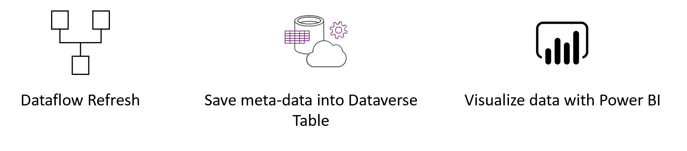

# Load Data into Dataverse Table and build Power BI report 
In this step-by-step example we will show you how to set up your own monitoring dashboard for Power BI and/or Power Platform dataflows:

You can use this dashboard to monitor your Dataflows Duration and Failure count. This way you can easily track any issues with your dataflows performance and share with others.

First, we are going to create a new table into Dataverse. This table will collect all the metadata from the dataflow run. For every refresh of a dataflow, we add a record to this table. We can run multiple dataflows all to the same table. When we have build the table, we can connect the .pbix file to the Dataverse Table.

## Requirements

* Download and Install [Power BI Desktop](https://www.microsoft.com/en-us/download/details.aspx?id=58494)

* Dataverse environment (with rights to create new custom tables)

* Power Automate Premium Licence

* A dataflow in Power BI or Power Platform

## Clone the repository

Clone the following git repository: git clone  https://github.com/miquelladeboer/dataflowdiagnostics
to get the .pbix template

## Create new table in Dataverse
* Navigate to https://powerapps.microsoft.com/
* Follow these [Instructions](https://docs.microsoft.com/en-us/powerapps/maker/common-data-service/create-custom-entity) to create a new table.

    In the right pane, enter the following values, and then select `Create`.
    * **Display name**  *Dataflows Monitoring*
    * **Column name**   *Dataflow ID*
* Follow the same instruction to add custom columns to the new table.

    In the right pane, enter the following values, and then select `Create`
    * **Display name** *Dataflow Name*
    * **Data type** *text*
    * **Required** *Required*
* Repeat adding column for the following values
    * **Display name** *Refresh Status*, **Data type** *Text*, **Required** *Required*
    * **Display name** *Refresh Type*, **Data type** *Text*, **Required** *Required*
    * **Display name** *Start Time*, **Data type** *Date and Time*, **Required** *Required*
    * **Display name** *End Time*, **Data type** *Date and Time*, **Required** *Required*

## Create a dataflow
If you do not already have one, create a Dataflow. This can be done in either [Power BI Dataflows](https://docs.microsoft.com/en-us/power-bi/transform-model/dataflows/dataflows-introduction-self-service) or [Power Apps Dataflows](https://docs.microsoft.com/en-us/powerapps/maker/common-data-service/create-and-use-dataflows).

## Create a Power Automate Flow
* Navigate to flow.microsoft.com
* Search for the template **When a dataflows refresh completes, output status into CDS entity**, by following these [instructions](https://docs.microsoft.com/en-us/power-automate/get-started-logic-template)

* Customize the flow
    Actions that require input from you will automatically be expanded.

   The **Dataflow Refresh** trigger is expanded because you need to enter *Dataflow*. You need to enter the following information:
   * **Group Type**: Choose *Environment* when connection to PowerApps and *Workspace* when connecting to Power BI
    * **Group**: Select the Power Apps environment or the Power BI workspace you dataflow is in
    * **Dataflow**: Select your dataflow by name

     The **Create new record** action is expanded because you need to enter you CDS *Environment* and *Entity Name*. You need to enter the following information:
   * **Environment**: The CDS environment you created the custom table in in step 1.
    * **Entity Name**: Select the entity/table *Dataflows Monitoring* you created in step 2

* Add dynamic values to the required fields

    For every required field, we are going to add a dynamic value. This value is the ouput of the meta-data of the dataflow run. 
    * click on the field  next to **Dataflow ID** and then click on the *lightning* button.

    * Add the Dataflow ID as the dynamic content

    * Repeat this proces for all required fields
  

* `Save` the flow

## Create Power BI Report
* open the `.pbix` file
* connect to your CDS entity **Dataflow Monitoring**

In this dashboard, you can monitor, for every dataflow, in your specified time interval:
* Dataflow duration
* Dataflow count
* Dataflow failure count

Note: The uniqueID for every dataflow is generated by a merge between Dataflow name and Start time.

[Go Back to Home Page](https://miquelladeboer.github.io/dataflowdiagnostics/)
